# Paseo 开发需求设计文档

> 基于源码逆向分析，推导系统设计意图，整理开发需求与设计决策。

---

## 目录

1. [项目概览](#1-项目概览)
2. [系统架构](#2-系统架构)
3. [包结构与依赖关系](#3-包结构与依赖关系)
4. [核心模块详解](#4-核心模块详解)
5. [WebSocket 通信协议](#5-websocket-通信协议)
6. [Agent 生命周期管理](#6-agent-生命周期管理)
7. [Agent Provider 体系](#7-agent-provider-体系)
8. [数据流与控制流](#8-数据流与控制流)
9. [存储设计](#9-存储设计)
10. [安全设计](#10-安全设计)
11. [构建系统](#11-构建系统)
12. [平台适配策略](#12-平台适配策略)
13. [测试策略](#13-测试策略)
14. [设计决策推导](#14-设计决策推导)

---

## 1. 项目概览

### 1.1 项目定位

Paseo 是一个**本地优先 (Local-First)** 的 AI 编程助手监控与控制平台。用户在自己的机器上运行 Daemon 进程管理多个 AI Agent（Claude Code、Codex、OpenCode 等），通过手机 App、CLI 工具或桌面应用实时观察和交互。

**核心价值主张：代码不离开本机，Paseo 只是"遥控器"。**

### 1.2 技术栈

| 层面             | 技术选择                            | 原因                                       |
| ---------------- | ----------------------------------- | ------------------------------------------ |
| 服务端运行时     | Node.js (TypeScript)                | 统一前后端类型，npm workspace 原生支持     |
| 通信协议         | WebSocket + 二进制多路复用          | 低延迟双向流，终端 I/O 与 Agent 流共享连接 |
| Schema 校验      | Zod                                 | 编译时类型推断 + 运行时校验，单一真源      |
| 客户端框架       | React Native (Expo)                 | 跨平台（iOS/Android/Web）一套代码          |
| 桌面端           | Electron                            | 复用 Web 客户端，管理本地 Daemon 子进程    |
| 端到端加密       | ECDH + XSalsa20-Poly1305 (NaCl box) | Relay 零知识传输                           |
| CLI              | Commander.js                        | Docker 风格命令体验                        |
| 构建/格式化/Lint | oxfmt + oxlint                      | Rust 编写，极快                            |
| 进程管理         | 原生 child_process                  | Agent 作为独立子进程运行                   |

### 1.3 支持的 AI Agent

| Agent                | Wrapper                                                | 模式            |
| -------------------- | ------------------------------------------------------ | --------------- |
| Claude Code          | Anthropic Agent SDK (`@anthropic-ai/claude-agent-sdk`) | query/SDK 模式  |
| Codex                | Codex AppServer 进程                                   | CLI 子进程模式  |
| OpenCode             | OpenCode CLI 进程                                      | CLI 子进程模式  |
| Copilot/GitHub Agent | ACP (Agent Client Protocol)                            | 标准 ACP 会话   |
| Custom ACP Agents    | 通用 ACP 适配器                                        | 自定义 ACP 端点 |
| Pi                   | Pi Direct 客户端                                       | Pi 专有协议     |

---

## 2. 系统架构

### 2.1 整体架构图

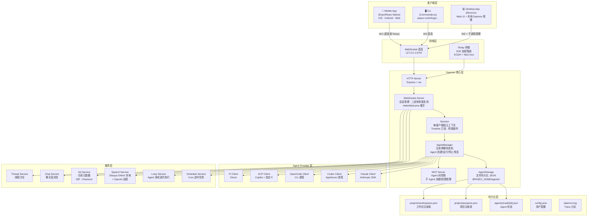

### 2.2 部署模型

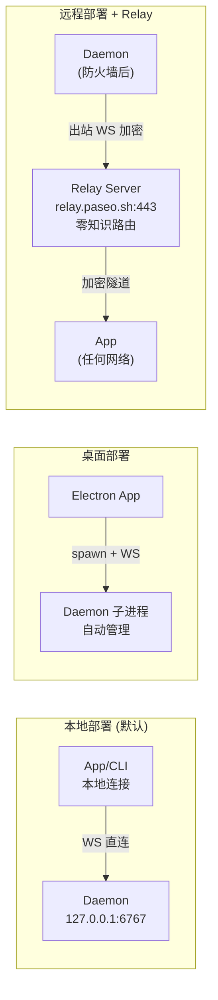

---

## 3. 包结构与依赖关系

### 3.1 Monorepo 布局

```
paseo/
├── packages/
│   ├── highlight/         # @getpaseo/highlight    — 语法高亮 (Lezer grammars)
│   ├── relay/             # @getpaseo/relay        — E2E 加密 Relay 库
│   ├── server/            # @getpaseo/server       — Daemon 核心
│   ├── app/               # @getpaseo/app          — 移动端 + Web 客户端 (Expo)
│   ├── cli/               # @getpaseo/cli          — 命令行工具
│   ├── desktop/           # —                        — Electron 桌面封装
│   ├── website/           # @getpaseo/website      — 营销网站 (paseo.sh)
│   ├── expo-two-way-audio/# @getpaseo/expo-two-way-audio — Expo 音频采集
│   └── obsidian-paseo-plugin/ # Obsidian 插件
├── docs/                  # 文档
└── scripts/               # 构建/发布脚本
```

### 3.2 构建依赖链

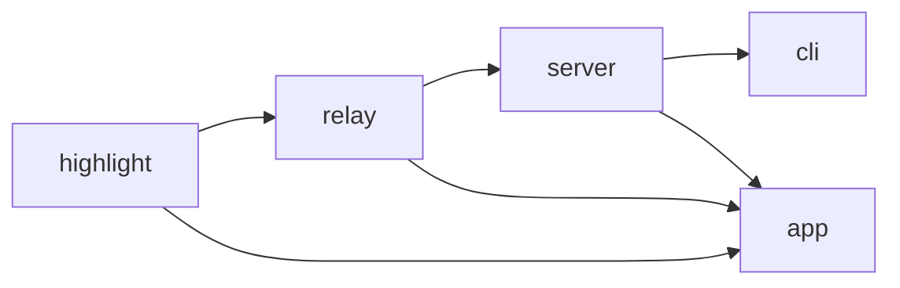

> 修改 `relay` 或 `server` 源码后，**必须重新构建** 才能让下游包（`cli`、`app`）看到变更。Server/CLI 从 `dist/` 导入，而非 `src/`。

### 3.3 包间引用关系

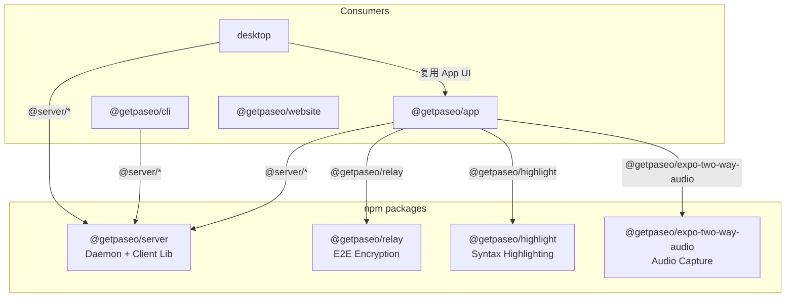

---

## 4. 核心模块详解

### 4.1 Daemon 启动流程 (`bootstrap.ts`)

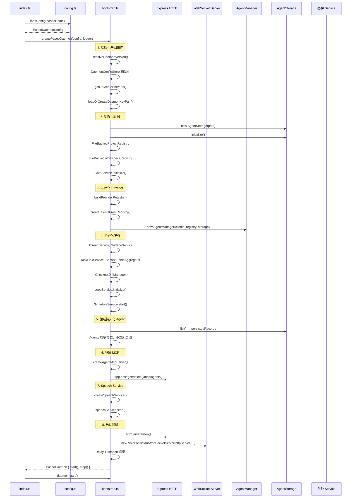

### 4.2 AgentManager 模块 (`agent-manager.ts`)

AgentManager 是整个系统的心脏，管理所有 Agent 的生命周期。

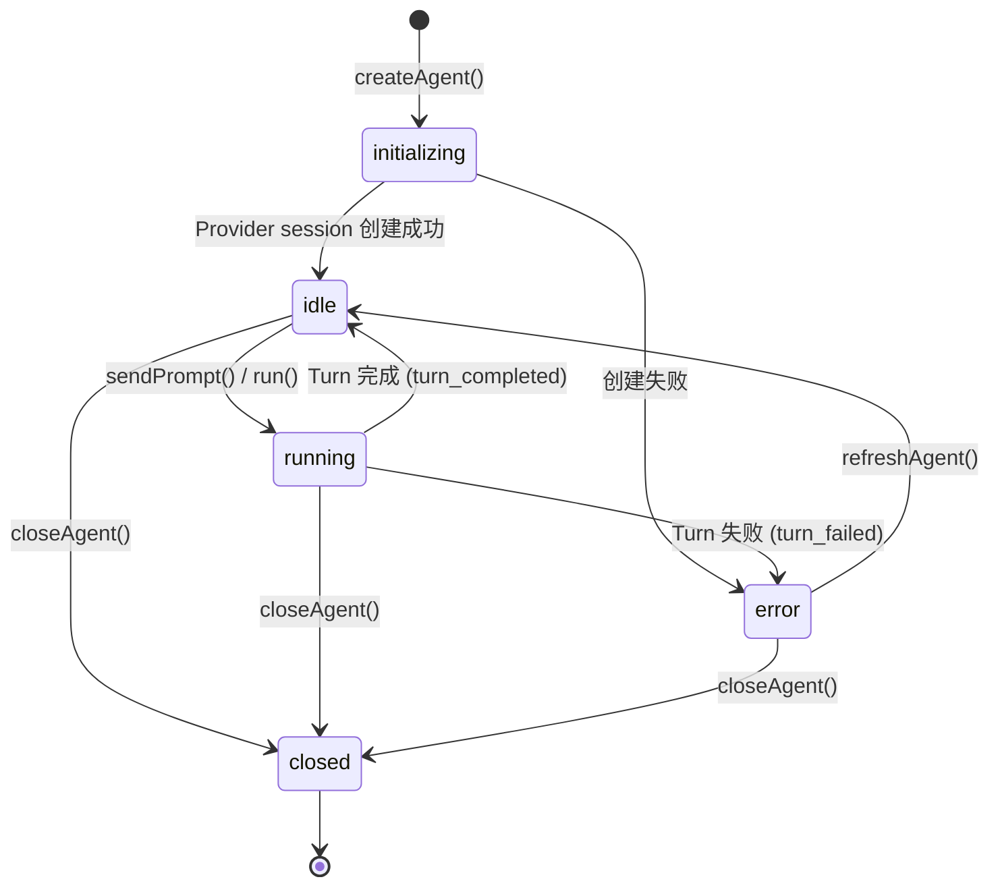

**核心职责：**

| 操作           | 说明                                                  |
| -------------- | ----------------------------------------------------- |
| `createAgent`  | 创建 Agent 会话，支持 workspace/worktree/git 配置     |
| `sendPrompt`   | 向 Agent 发送消息，支持图片附件、GitHub Issue/PR 附件 |
| `closeAgent`   | 关闭 Agent，释放资源                                  |
| `refreshAgent` | 刷新 Provider 状态（如模型列表变更）                  |
| `cancelAgent`  | 中断正在运行的 Agent turn                             |
| `subscribe`    | 订阅 Agent 流事件（实时推送）                         |
| `getTimeline`  | 分页获取 Timeline（支持 cursor 分页、方向控制）       |
| `resolveAgent` | 通过 ID/前缀/标题 解析 Agent                          |

**Timeline 模型：**

- 每次 `run()` 创建一个新 **epoch**
- 每个 epoch 内的事件从 seq=1 开始递增
- 每条 Timeline 条目是 `(epoch, seq)` 二元组
- 客户端用 cursor 做断点续传和增量同步
- 每个 Agent 最多保留 200 条 Timeline 条目

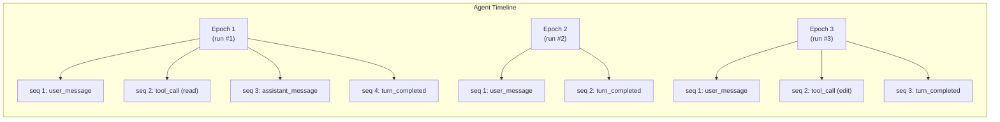

### 4.3 Session 模块 (`session.ts`)

每个客户端连接对应一个 Session 实例，约 10,000 行，是 Daemon 中最复杂的模块。

**核心职责：**

| 职责               | 说明                                         |
| ------------------ | -------------------------------------------- |
| WebSocket 消息路由 | 接收 `SessionInboundMessage`，分发到各处理器 |
| Timeline 订阅管理  | 客户端订阅特定 Agent 的 Timeline 流          |
| 终端管理           | 创建/订阅/销毁 PTY 终端，终端 I/O 二进制流   |
| 权限审批流         | Agent 请求权限 → Session 转发 → 客户端决策   |
| 语音模式           | TTS/STT 管理，Turn detection                 |
| Git 操作代理       | Checkout、Diff、Commit、Merge、Push、PR      |
| 工作区管理         | 项目/工作区的增删改查                        |
| 文件浏览           | 文件列表、文件读取、下载 Token 生成          |
| Editor 集成        | 在 Cursor/VSCode/Zed/WebStorm 中打开文件     |
| Dictation 流       | 客户端实时音频流 → 文本转录                  |

**Session → 客户端 出站消息类型：**

```
agent_update      — Agent 状态变更
agent_stream      — Timeline 新事件
workspace_update  — 工作区变更
agent_permission_request — 权限请求
checkout_diff_update     — Git Diff 变更
terminal_state           — 终端输出
audio_output             — TTS 音频
```

### 4.4 WebSocket Server (`websocket-server.ts`)

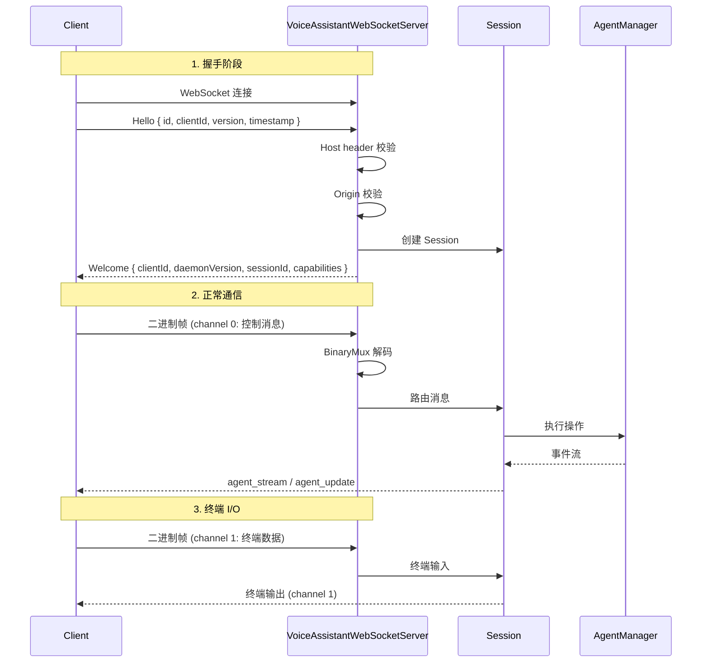

**二进制多路复用协议：**

| Byte 0                      | Byte 1 | Bytes 2+ |
| --------------------------- | ------ | -------- |
| Channel ID (0=控制, 1=终端) | Flags  | Payload  |

单个 WebSocket 连接同时传输控制消息和终端流。

### 4.5 Relay 传输层 (`relay-transport.ts` + `packages/relay`)

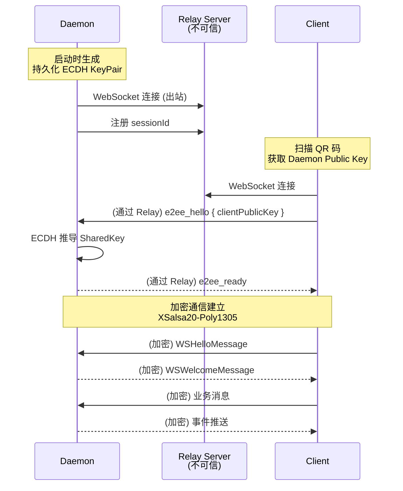

**安全保证：**

- Relay 仅看到：IP 地址、时间戳、消息大小、Session ID
- Relay 无法：读取内容、伪造消息、推导密钥
- 每次连接生成新鲜 encryption keys，跨会话不可重放

### 4.6 Provider 插件体系

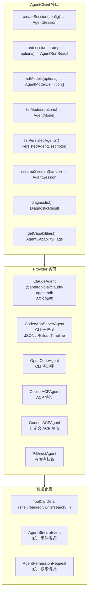

**Tool Call 标准化类型：**

| Tool Type        | 说明                 | 字段                                        |
| ---------------- | -------------------- | ------------------------------------------- |
| `shell`          | Shell 命令执行       | command, cwd, output, exitCode              |
| `read`           | 文件读取             | filePath, content, offset, limit            |
| `edit`           | 文件编辑             | filePath, oldString, newString, unifiedDiff |
| `write`          | 文件写入             | filePath, content                           |
| `search`         | 搜索 (grep/glob/web) | query, content, filePaths, numMatches       |
| `fetch`          | 网络请求             | url, result, code, durationMs               |
| `sub_agent`      | 子 Agent 任务        | subAgentType, log, actions                  |
| `plan`           | 计划模式输出         | text                                        |
| `worktree_setup` | Worktree 初始化      | worktreePath, commands                      |
| `plain_text`     | 通用文本展示         | label, text                                 |
| `unknown`        | 兜底类型             | input, output                               |

### 4.7 MCP Server (`mcp-server.ts`)

允许 Agent 以 MCP (Model Context Protocol) 方式调用 Daemon 能力：

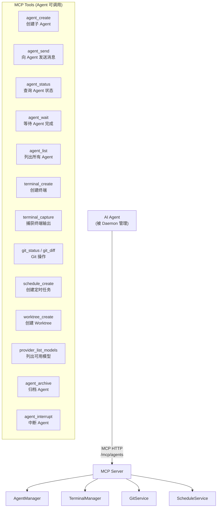

### 4.8 Speech Service (`speech/`)

支持本地和远程语音引擎：

| Provider            | 功能             | 引擎                     |
| ------------------- | ---------------- | ------------------------ |
| Local (Sherpa-ONNX) | STT (语音转文本) | Sherpa-Onnx + Silero VAD |
| Local (Sherpa-ONNX) | TTS (文本转语音) | Sherpa-Onnx              |
| Local (Pocket)      | TTS              | Pocket TTS (ONNX)        |
| OpenAI              | STT              | Whisper API              |
| OpenAI              | TTS              | TTS API                  |
| OpenAI              | Realtime         | WebRTC Realtime API      |

### 4.9 定时任务 (Schedule Service)

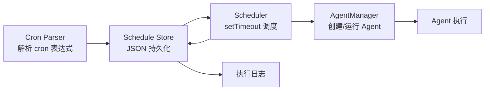

### 4.10 Loop Service

支持 Agent 多轮迭代执行模式：

```
Loop:  [迭代1: Worker 执行] → [迭代1: Verifier 校验]
    → [迭代2: Worker 执行] → [迭代2: Verifier 校验]
    → ...
    → [最终结果]
```

---

## 5. WebSocket 通信协议

### 5.1 协议分层

```
┌─────────────────────────────────────────┐
│         Application Messages            │
│    (JSON, Zod Schema Validated)         │
├─────────────────────────────────────────┤
│         Binary Mux Layer                │
│    Channel 0: Control Messages          │
│    Channel 1: Terminal Stream           │
├─────────────────────────────────────────┤
│         Transport Layer                 │
│    Direct WebSocket                     │
│    Relay (E2E Encrypted WebSocket)      │
└─────────────────────────────────────────┘
```

### 5.2 消息类型全集

**客户端 → 服务端 (Inbound)：**

| 类别       | 消息类型                                            | 用途                 |
| ---------- | --------------------------------------------------- | -------------------- |
| Agent CRUD | `create_agent_request`                              | 创建 Agent           |
|            | `delete_agent_request`                              | 删除 Agent           |
|            | `archive_agent_request`                             | 归档 Agent           |
|            | `update_agent_request`                              | 更新 Agent 名称/标签 |
|            | `resume_agent_request`                              | 恢复持久化会话       |
| Agent 交互 | `send_agent_message` / `send_agent_message_request` | 发送消息             |
|            | `cancel_agent_request`                              | 取消运行             |
|            | `wait_for_finish_request`                           | 等待完成             |
|            | `agent_permission_response`                         | 权限审批结果         |
| 查询       | `fetch_agents_request`                              | 获取 Agent 列表      |
|            | `fetch_agent_request`                               | 获取单个 Agent       |
|            | `fetch_agent_timeline_request`                      | 分页获取 Timeline    |
|            | `fetch_workspaces_request`                          | 获取工作区列表       |
| Provider   | `list_provider_models_request`                      | 模型列表             |
|            | `list_provider_modes_request`                       | 模式列表             |
|            | `get_providers_snapshot_request`                    | Provider 快照        |
|            | `refresh_providers_snapshot_request`                | 刷新快照             |
| 终端       | `create_terminal_request`                           | 创建终端             |
|            | `subscribe_terminal_request`                        | 订阅终端流           |
|            | `terminal_input`                                    | 终端输入             |
|            | `kill_terminal_request`                             | 关闭终端             |
|            | `capture_terminal_request`                          | 捕获输出             |
| Git        | `checkout_status_request`                           | Git 状态             |
|            | `subscribe_checkout_diff_request`                   | 订阅 Diff            |
|            | `checkout_commit_request`                           | 提交                 |
|            | `checkout_merge_request`                            | 合并                 |
|            | `checkout_pull/push_request`                        | 拉取/推送            |
|            | `checkout_pr_create_request`                        | 创建 PR              |
|            | `stash_save/pop/list_request`                       | Stash 操作           |
| 文件       | `file_explorer_request`                             | 文件浏览             |
|            | `file_download_token_request`                       | 下载 Token           |
|            | `open_in_editor_request`                            | 在编辑器中打开       |
| 语音       | `voice_audio_chunk`                                 | 音频数据             |
|            | `set_voice_mode`                                    | 开关语音模式         |
|            | `dictation_stream_*`                                | 听写流               |
| 配置       | `get/set_daemon_config_request`                     | Daemon 配置          |
|            | `read/write_project_config_request`                 | 项目配置             |
| 生命周期   | `shutdown_server_request`                           | 关闭 Daemon          |
|            | `restart_server_request`                            | 重启 Daemon          |
|            | `client_heartbeat`                                  | 心跳                 |

**服务端 → 客户端 (Outbound)：**

| 类别      | 消息类型                   | 用途                  |
| --------- | -------------------------- | --------------------- |
| 握手      | `welcome`                  | 连接确认 + 能力声明   |
| Agent 流  | `agent_update`             | Agent 状态变更广播    |
|           | `agent_stream`             | Timeline 事件实时推送 |
| Workspace | `workspace_update`         | 工作区状态变更        |
| 权限      | `agent_permission_request` | 权限请求通知          |
| 终端      | `terminal_state`           | 终端输出流            |
| 语音      | `audio_output`             | TTS 音频输出          |
|           | `voice_mode_update`        | 语音模式状态          |
| Git       | `checkout_diff_update`     | Diff 实时更新         |
| 响应      | 各类 `*_response`          | RPC 请求的响应        |

### 5.3 连接恢复协议

客户端断开重连时，提供 `lastKnownCursor` 恢复遗漏事件：

```
Client → Server: connection/reconnect { lastKnownCursor: "epoch_seq" }
Server → Client: connection/reconnect/response {
    missedEvents: [...],
    resumeCursor: "latest_cursor"
}
```

---

## 6. Agent 生命周期管理

### 6.1 完整生命周期

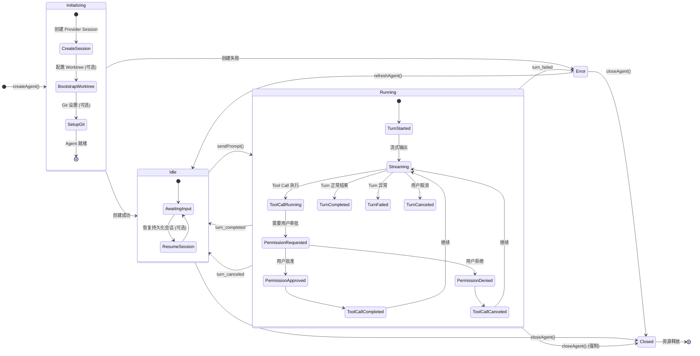

### 6.2 Agent 创建流程

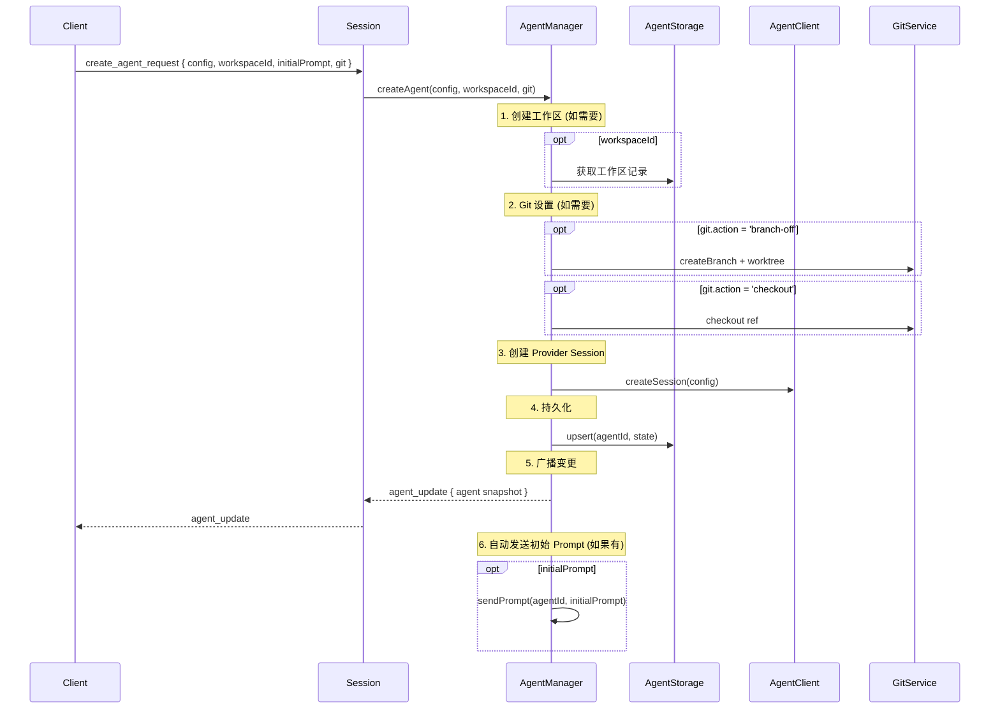

### 6.3 Agent 运行流程 (Streaming)

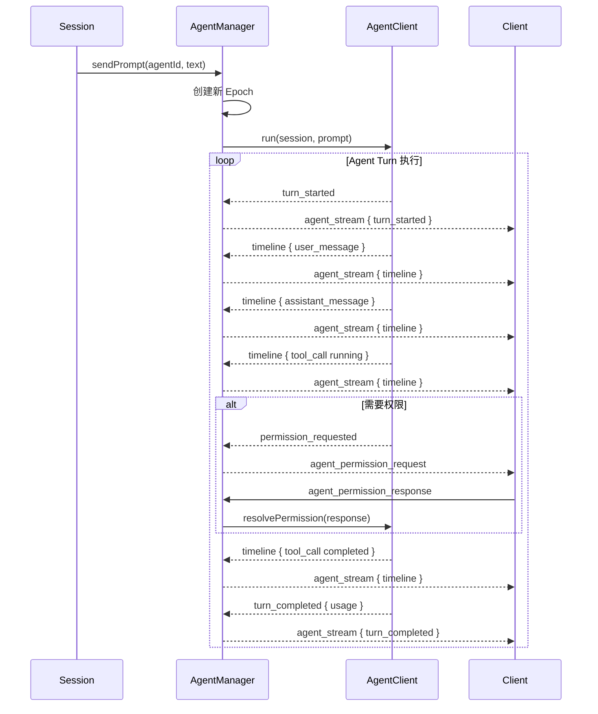

---

## 7. Agent Provider 体系

### 7.1 Provider 配置架构

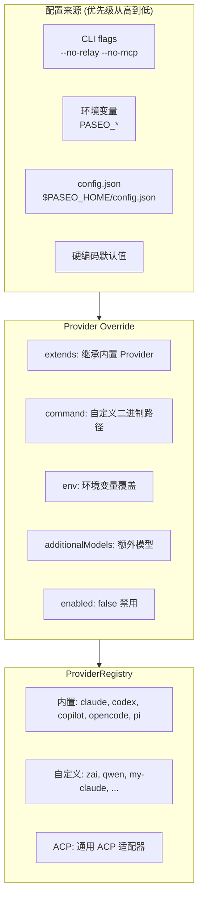

### 7.2 Claude Agent 实现

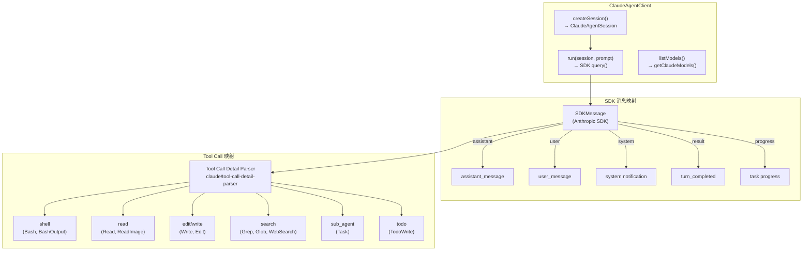

### 7.3 Codex Agent 实现 (CLI 子进程模式)

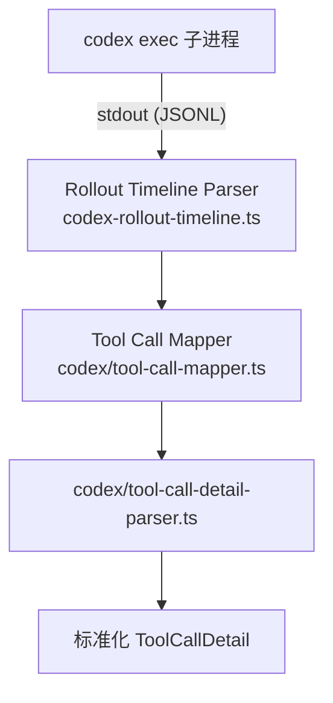

### 7.4 ACP (Agent Client Protocol) 适配

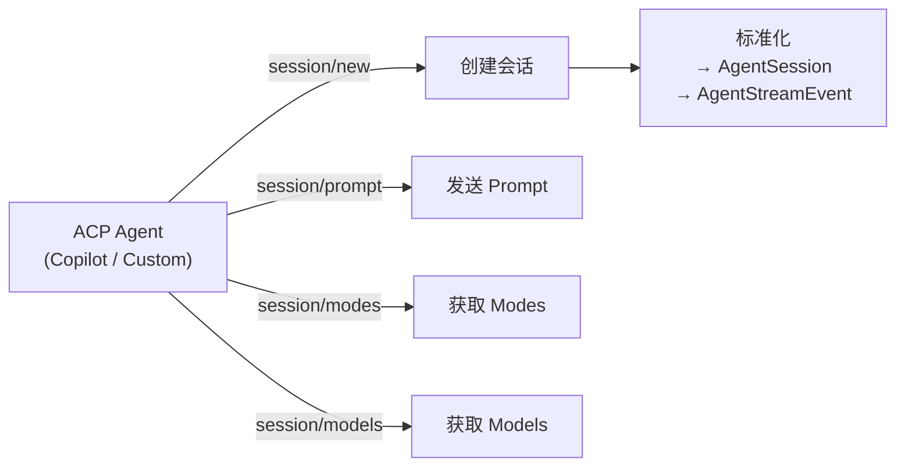

---

## 8. 数据流与控制流

### 8.1 完整数据流图

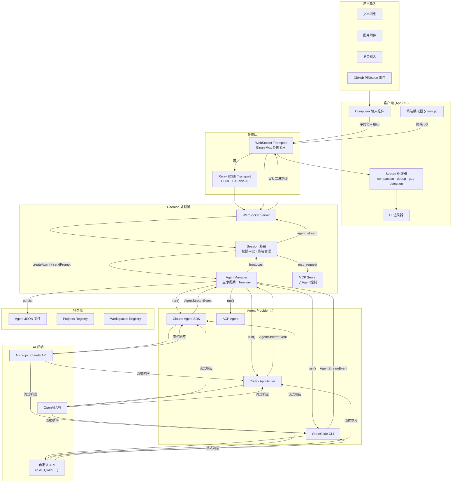

### 8.2 权限审批流

```mermaid
sequenceDiagram
    participant Provider as Agent Provider
    participant AgentMgr as AgentManager
    participant Session
    participant Client as 客户端 (App/CLI)
    participant User as 用户

    Provider->>AgentMgr: permission_requested { request: { id, name, kind, input } }
    AgentMgr->>AgentMgr: 存储 pending permission
    AgentMgr->>Session: agent_permission_request
    Session->>Session: 检查 auto-approval 策略
    alt 自动批准
        Session->>AgentMgr: agent_permission_response { behavior: "allow" }
        AgentMgr->>Provider: resolvePermission("allow")
    else 需要用户审批
        Session->>Client: agent_permission_request
        Client->>Client: 发送推送通知 (如需要)
        Client->>User: 展示权限请求 UI
        User->>Client: 批准 / 拒绝
        Client->>Session: agent_permission_response { behavior: "allow" | "deny" }
        Session->>AgentMgr: agent_permission_response
        AgentMgr->>AgentMgr: 更新/持久化权限策略
        AgentMgr->>Provider: resolvePermission(response)
    end
    Provider-->>AgentMgr: permission_resolved
    AgentMgr-->>Client: agent_stream { permission_resolved }
```

### 8.3 终端流数据路径

```mermaid
sequenceDiagram
    participant Client
    participant Session
    participant TerminalMgr as TerminalManager
    participant PTY as node-pty 进程
    participant Coalescer as TerminalOutputCoalescer

    Client->>Session: create_terminal_request { cwd, command }
    Session->>TerminalMgr: createTerminal(cwd, command)
    TerminalMgr->>PTY: spawn shell

    loop 终端 I/O
        PTY-->>TerminalMgr: data (stdout)
        TerminalMgr->>Coalescer: 合并输出 (防抖动)
        Coalescer-->>Session: 编码 TerminalStreamFrame
        Session-->>Client: terminal_state (二进制帧 channel 1)

        Client->>Session: terminal_input { data }
        Session->>TerminalMgr: 写入 PTY stdin
        TerminalMgr->>PTY: input

        Client->>Session: terminal_input { resize }
        Session->>TerminalMgr: PTY resize(rows, cols)
    end
```

---

## 9. 存储设计

### 9.1 目录结构

```
$PASEO_HOME/                          # 默认 ~/.paseo
├── config.json                        # Daemon 持久化配置
├── daemon.log                         # Trace 级别日志
├── pid.lock                           # PID 锁文件
├── agents/                            # Agent 存储
│   └── {cwd-with-dashes}/             # 按工作目录分组
│       ├── {agent-id}.json            # Agent 状态 + 配置 + Timeline
│       └── ...
├── projects/                          # 项目/工作区注册表
│   ├── projects.json
│   └── workspaces.json
├── db/                                # (可选) SQLite 数据库
│   └── paseo.sqlite
├── loops/                             # Loop 执行记录
├── chat/                              # 聊天室消息
│   └── {channelId}/
│       └── messages.jsonl
├── tasks/                             # 任务链接
├── threads/                           # 线程消息
└── surfaces/                          # 用户界面状态
```

### 9.2 Agent JSON 结构

```typescript
interface StoredAgentRecord {
  id: string; // UUID
  provider: string; // "claude" | "codex" | "opencode" | ...
  cwd: string; // 工作目录
  model: string | null; // 模型 ID
  status: AgentLifecycleStatus; // "initializing" | "idle" | "running" | "error" | "closed"
  createdAt: string; // ISO 时间戳
  updatedAt: string;
  lastUserMessageAt: string | null;
  archivedAt: string | null;

  // 会话持久化
  persistence: {
    provider: string;
    sessionId: string;
    nativeHandle?: string; // Provider 特定句柄
    metadata?: Record<string, unknown>;
  } | null;

  // 运行时信息
  runtimeInfo: {
    provider: string;
    sessionId: string | null;
    model?: string | null;
    modeId?: string | null;
  };

  // 能力标志
  capabilities: {
    supportsStreaming: boolean;
    supportsSessionPersistence: boolean;
    supportsDynamicModes: boolean;
    supportsMcpServers: boolean;
    supportsReasoningStream: boolean;
    supportsToolInvocations: boolean;
  };

  // 模式
  currentModeId: string | null;
  availableModes: AgentMode[];

  // 权限
  pendingPermissions: AgentPermissionRequest[];

  // 使用统计
  lastUsage?: AgentUsage;

  // 元数据
  title: string | null;
  labels: Record<string, string>;

  // 注意力
  requiresAttention?: boolean;
  attentionReason?: "finished" | "error" | "permission" | null;
  attentionTimestamp?: string | null;

  // Serialized ProjectPlacement (DAEMON STATE)
  projectPlacement?: { projectId: string; workspaceId: string };
}
```

### 9.3 数据模型关系

```mermaid
erDiagram
    Project ||--o{ Workspace : contains
    Workspace ||--o{ Agent : runs_in

    Project {
        string projectId PK
        string rootPath
        string kind "git | non_git"
        string displayName
        string createdAt
        string updatedAt
        string archivedAt
    }

    Workspace {
        string workspaceId PK
        string projectId FK
        string cwd
        string kind "local_checkout | worktree | directory"
        string displayName
        string createdAt
        string updatedAt
        string archivedAt
    }

    Agent {
        string id PK
        string provider
        string cwd
        string model
        string status
        string createdAt
        string updatedAt
        string title
        json labels
        json persistence
        json runtimeInfo
        json pendingPermissions
    }

    ChatChannel {
        string channelId PK
        string name
        string createdAt
    }

    ChatMessage {
        string messageId PK
        string channelId FK
        string authorAgentId
        string body
        string replyToMessageId
        string createdAt
    }
```

---

## 10. 安全设计

### 10.1 信任边界

```mermaid
graph TB
    subgraph Untrusted["不可信区域"]
        Network["外部网络"]
        RelayServer["Relay Server<br/>(不可信)"]
    end

    subgraph TrustBoundary["信任边界 — 网络可达性"]
        Localhost["127.0.0.1<br/>(受信)"]
    end

    subgraph Trusted["受信区域"]
        Daemon["Daemon<br/>Agent 在你用户上下文中运行"]
        Agents["Agent 子进程<br/>继承用户凭证"]
    end

    Network -->|"E2E 加密"| RelayServer
    RelayServer -->|"加密隧道"| Daemon
    Localhost -->|"直连 WS"| Daemon
    Daemon -->|"spawn"| Agents
```

### 10.2 安全控制层次

| 层次     | 控制                                  | 说明                                          |
| -------- | ------------------------------------- | --------------------------------------------- |
| 网络层   | Host header 校验 (DNS rebinding 防护) | 拒绝未知 Host 的请求                          |
| 网络层   | CORS Origin 校验                      | 仅允许配置的 Origin + `paseo://app`           |
| 传输层   | ECDH + XSalsa20-Poly1305              | Relay 模式下端到端加密                        |
| 握手层   | `e2ee_hello` → `e2ee_ready`           | Relay 模式必须先完成密钥交换                  |
| 应用层   | QR Code / Pairing Link                | 信任锚点，包含 Daemon Public Key              |
| Agent 层 | 权限请求审批                          | Agent 执行危险操作前必须用户批准              |
| Agent 层 | Provider 自身认证                     | Paseo 不管理 API Key，Agent Provider 自行处理 |

### 10.3 Relay 威胁模型

```
攻击者能力 (Relay Server 被攻陷)：
✅ 观察 IP 地址、连接时间、消息大小
✅ 丢弃或延迟消息 (DoS)
❌ 读取消息内容 (XSalsa20-Poly1305 加密)
❌ 伪造消息 (认证加密，篡改被检测)
❌ 推导共享密钥 (ECDH 前向安全性)
❌ 跨会话重放消息 (每次连接新鲜密钥)
```

---

## 11. 构建系统

### 11.1 构建流程

```mermaid
graph LR
    subgraph "开发环境"
        Source["TypeScript 源码"]
        DevServer["npm run dev<br/>Tmux: Daemon + Expo"]
    end

    subgraph "Type Checking"
        Tsgo["tsgo --noEmit<br/>(TypeScript 7.0 preview)"]
    end

    subgraph "构建"
        TSC["tsc -p tsconfig.json"]
        Dist["dist/ 输出"]
        Pack["npm pack --dry-run"]
    end

    subgraph "Lint & Format"
        Oxlint["oxlint<br/>(Rust, 极快)"]
        Oxfmt["oxfmt<br/>(Rust, 极快)"]
    end

    subgraph "测试"
        Vitest["Vitest<br/>单元 + 集成测试"]
        Playwright["Playwright<br/>E2E 测试 (Web)"]
    end

    Source --> DevServer
    Source --> Tsgo
    Source --> TSC
    TSC --> Dist
    Dist --> Pack
    Source --> Oxlint
    Source --> Oxfmt
    Source --> Vitest
    Source --> Playwright
```

### 11.2 构建顺序约束

```
highlight → relay → server → cli
                ↘       ↗
                 app (也依赖 highlight)
```

构建命令：

```bash
npm run build:highlight       # 仅 highlight
npm run build:daemon          # highlight → relay → server → cli
npm run build --workspace=@getpaseo/server  # 单个包
```

### 11.3 版本发布流程

```mermaid
graph LR
    Check["release:check<br/>typecheck + build + npm pack"] --> Version["version:all:*<br/>更新所有包版本号"]
    Version --> Publish["release:publish<br/>npm publish (4个包)"]
    Publish --> Push["release:push<br/>推送 release tag"]
```

---

## 12. 平台适配策略

### 12.1 平台门控矩阵

| 条件          | 使用方式                   | 场景                                                                 |
| ------------- | -------------------------- | -------------------------------------------------------------------- |
| Web 环境      | `if (isWeb)`               | DOM API: document, window, `<div>`, addEventListener, ResizeObserver |
| Native 环境   | `if (isNative)`            | Haptics, StatusBar, 推送 Token, 相机, expo-av                        |
| Electron 环境 | `if (getIsElectron())`     | 文件对话框, 标题栏拖拽, Daemon 管理, 应用更新                        |
| 紧凑布局      | `useIsCompactFormFactor()` | 侧边栏叠加 vs 固定, 模态 vs 全屏, 单面板 vs 分栏                     |
| 平台特定      | `Platform.OS === "ios"`    | 罕见，尽量内联                                                       |

### 12.2 文件组织策略

```
components/
├── thing.tsx            # 跨平台默认实现
├── thing.web.tsx        # Web 特定 (Metro 自动解析)
└── thing.native.tsx     # Native 特定 (Metro 自动解析)

hooks/
├── use-thing.ts         # 跨平台
├── use-thing.web.ts     # Web
└── use-thing.native.ts  # Native
```

默认跨平台，仅在必要时门控。优先使用 Metro 文件扩展名解析。

---

## 13. 测试策略

### 13.1 测试层次

```mermaid
graph TB
    subgraph "E2E Tests (Playwright)"
        E2E["端到端<br/>Metro localhost:8081<br/>真实 Daemon + Web 客户端"]
    end

    subgraph "Integration Tests (Vitest)"
        RealE2E["real.e2e.test.ts<br/>真实 Agent Provider<br/>需要 API Key"]
        LocalE2E["local.e2e.test.ts<br/>本地集成<br/>Mock Daemon"]
    end

    subgraph "Unit Tests (Vitest)"
        Unit["*.test.ts<br/>纯函数 + 模块单元<br/>Zod Schema 验证"]
    end

    subgraph "CLI Tests"
        CLITest["tsx tests/run-all.ts<br/>自定义 CLI Test Runner"]
    end

    E2E --> RealE2E
    RealE2E --> Unit
    LocalE2E --> Unit
    CLITest --> Unit
```

### 13.2 测试原则

- **NEVER 在本地运行完整测试套件** — 套件太重，可能导致机器卡死
- 只运行改动的测试文件：`npx vitest run <file> --bail=1`
- 全量测试在 CI 执行
- **不加 Auth 检查到测试中** — Agent Provider 自行处理认证
- 测试中优先使用真实依赖而非 Mock
- App 测试使用 `pool: "forks"`（Expo 需要 `process.send`）

---

## 14. 设计决策推导

基于源码分析，推导以下关键设计决策及其意图：

### 14.1 为什么 Agent 作为独立进程运行？

**证据：** `ClaudeAgentClient` 通过 SDK 管理进程，`CodexAgentClient` spawn `codex exec` 子进程，`OpenCodeAgentClient` 同理。

**意图：**

- **进程隔离：** 一个 Agent 崩溃不影响其他 Agent 或 Daemon
- **用户上下文：** Agent 继承当前用户的 shell 环境、凭证、工具链
- **标准输入输出：** 通过 stdin/stdout 和 JSONL 事件流实现松耦合通信
- **可恢复性：** Provider 自身管理会话持久化（Claude 的 session-id.jsonl，Codex 的 rollout JSONL）

### 14.2 为什么使用 Zod Schema 驱动消息协议？

**证据：** `shared/messages.ts` 中所有消息类型均由 Zod Schema 定义 + `z.infer<>` 推导 TypeScript 类型。

**意图：**

- **单一真源 (Single Source of Truth)：** Zod Schema 既是运行时校验器，也是编译时类型
- **向后兼容：** 新字段 `.optional()`，旧字段保留（deprecate），schema 永远向前兼容
- **边界校验：** 在传输边界解析外部数据，内部信任类型
- **6 个月前旧客户端 vs 新 Daemon 仍可互通**

### 14.3 为什么设计 Binary Mux 多路复用？

**证据：** `BinaryMuxFrame` — Channel 0 控制消息，Channel 1 终端数据。

**意图：**

- **单一连接：** 避免为终端 I/O 单独建立 WebSocket 连接
- **低延迟：** 终端输出不需要 JSON 序列化开销
- **有序性：** 控制消息和终端数据在同一 TCP 连接上，保证顺序

### 14.4 为什么 Relay 使用 ECDH + NaCl box？

**证据：** `packages/relay/src/crypto.ts` — tweetnacl + base64-js，`encrypted-channel.ts` — ECDH 握手。

**意图：**

- **零知识 Relay：** Relay 不可信，只做加密字节路由
- **前向安全性：** 每次连接生成新鲜密钥
- **轻量级依赖：** 仅依赖 `tweetnacl`（纯 JS，无原生依赖），npm 包体积小
- **NaCl box = Curve25519 + XSalsa20 + Poly1305：** 业界公认的认证加密方案

### 14.5 为什么 Agent 按需加载（Lazy Initialization）？

**证据：** `bootstrap.ts` 中 `persistedRecords` 仅加载列表，Agent 不在启动时恢复。`ensureAgentLoaded()` 函数按需初始化。

**意图：**

- **快速启动：** 用户可能有几十个 Agent，全部恢复会显著增加 Daemon 启动时间
- **资源效率：** 不活跃的 Agent 不占用 Provider 会话资源
- **Provider 可用性：** 某个 Agent 的 Provider 当前不可用时，不影响其他 Agent

### 14.6 为什么 Timeline 使用 Epoch + Seq 模型？

**证据：** `agent-timeline-store.ts` — 每次 run() 创建新 epoch，seq 从 1 开始。

**意图：**

- **增量同步：** 客户端用 `(epoch, seq)` cursor 请求后续事件
- **断点续传：** 重连后通过 `connection/reconnect` 恢复遗漏事件
- **Compaction 支持：** 上下文压缩事件在 Timeline 中标记，客户端可据此重建视图
- **确定性：** 每个 epoch 从 seq=1 开始，排序由 epoch+seq 共同决定

### 14.7 为什么工具调用需要标准化为统一 ToolCallDetail？

**证据：** 每个 Provider 有独立的 `tool-call-detail-parser.ts` 和 `tool-call-mapper.ts`。

**意图：**

- **Provider 无关的 UI：** 客户端不关心底层是 Claude 还是 Codex，统一渲染 Tool Call 卡片
- **可扩展性：** 新增 Provider 只需实现 parser + mapper
- **标准化类型：** shell / read / edit / write / search / fetch / sub_agent / plan 覆盖 AI 编程助手所有常用操作

### 14.8 为什么 Server 也导出 Client 库？

**证据：** `packages/server/src/client/daemon-client.ts` — App 和 CLI 都通过 `@server/client/daemon-client` 连接 Daemon。

**意图：**

- **共享通信层：** App 和 CLI 使用同一套 WebSocket 客户端代码
- **类型安全：** Zod Schema 在客户端和服务端共享
- **单一协议实现：** 避免 App/CLI 各自实现 WebSocket 协议而导致不一致

### 14.9 为什么语音使用本地 + 远程双引擎？

**证据：** `speech/providers/local/sherpa/` — Sherpa-ONNX 本地引擎，`speech/providers/openai/` — OpenAI 远程引擎。

**意图：**

- **离线可用：** 本地 Sherpa-ONNX 模型不依赖网络，隐私友好
- **高质量选项：** OpenAI Realtime API 提供更高质量的语音识别和合成
- **灵活切换：** 用户可选择本地或远程引擎
- **Sherpa-ONNX：** C++ 实现，通过 Node.js native addon 调用，低延迟

### 14.10 为什么采用 Monorepo + npm Workspaces？

**证据：** 根 `package.json` 的 `workspaces` 数组包含 9 个包。

**意图：**

- **类型共享：** Server 的类型定义直接导入到 App 和 CLI，无需额外包
- **原子提交：** 跨包变更在同一个 PR 中，避免版本不同步
- **统一工具链：** 一个 `npm run typecheck` 检查所有包
- **发布解耦：** 仅 highlight、relay、server、cli 4 个包发布到 npm，其他为私有包

---

## 附录 A：关键文件索引

| 文件                                                                   | 行数   | 职责                                        |
| ---------------------------------------------------------------------- | ------ | ------------------------------------------- |
| `packages/server/src/server/index.ts`                                  | ~150   | Daemon 入口，进程管理                       |
| `packages/server/src/server/bootstrap.ts`                              | ~500   | Daemon 初始化，组装所有组件                 |
| `packages/server/src/server/config.ts`                                 | ~200   | 配置加载 (Env → CLI → Persisted → Defaults) |
| `packages/server/src/server/websocket-server.ts`                       | ~1900  | WebSocket 连接管理，BinaryMux               |
| `packages/server/src/server/session.ts`                                | ~10000 | 每客户端会话，消息路由                      |
| `packages/server/src/server/agent/agent-manager.ts`                    | ~3200  | Agent 生命周期管理                          |
| `packages/server/src/shared/messages.ts`                               | ~3800  | 所有消息 Schema 定义                        |
| `packages/server/src/server/agent/agent-sdk-types.ts`                  | ~500   | Agent SDK 接口定义                          |
| `packages/server/src/server/agent/providers/claude-agent.ts`           | ~4500  | Claude Agent 实现                           |
| `packages/server/src/server/agent/providers/codex-app-server-agent.ts` | ~4500  | Codex Agent 实现                            |
| `packages/server/src/server/agent/mcp-server.ts`                       | ~2000  | MCP Server 实现                             |
| `packages/server/src/client/daemon-client.ts`                          | ~4600  | 客户端连接库                                |
| `packages/relay/src/encrypted-channel.ts`                              | ~400   | E2E 加密通道                                |
| `packages/relay/src/crypto.ts`                                         | ~200   | ECDH + NaCl 加密实现                        |
| `packages/app/src/contexts/session-context.tsx`                        | ~1800  | App Session 上下文                          |
| `packages/app/src/types/stream.ts`                                     | ~1000  | Stream 模型                                 |
| `packages/cli/src/cli.ts`                                              | ~200   | CLI 入口                                    |

## 附录 B：环境变量参考

| 变量                          | 用途               | 默认值                 |
| ----------------------------- | ------------------ | ---------------------- |
| `PASEO_HOME`                  | 运行时状态目录     | `~/.paseo`             |
| `PASEO_LISTEN`                | 监听地址           | `127.0.0.1:6767`       |
| `PASEO_RELAY_ENABLED`         | 启用 Relay         | `true`                 |
| `PASEO_RELAY_ENDPOINT`        | Relay 地址         | `relay.paseo.sh:443`   |
| `PASEO_RELAY_PUBLIC_ENDPOINT` | Relay 公开端点     | 同 endpoint            |
| `PASEO_APP_BASE_URL`          | App 基础 URL       | `https://app.paseo.sh` |
| `PASEO_CORS_ORIGINS`          | CORS 允许的 Origin | —                      |
| `PASEO_HOSTNAMES`             | 允许的 Hostname    | —                      |
| `PASEO_VOICE_LLM_PROVIDER`    | 语音 LLM Provider  | —                      |
| `PASEO_SUPERVISED`            | 父进程管理模式     | —                      |
| `MCP_DEBUG`                   | MCP 调试模式       | `0`                    |
| `PORT`                        | (回退) TCP 端口    | `6767`                 |
