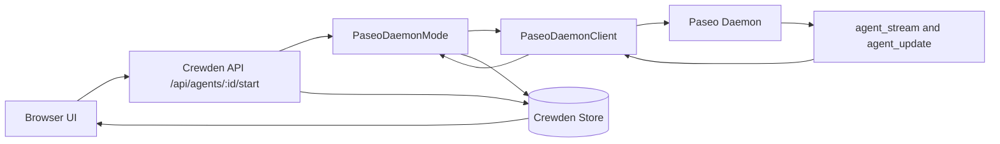
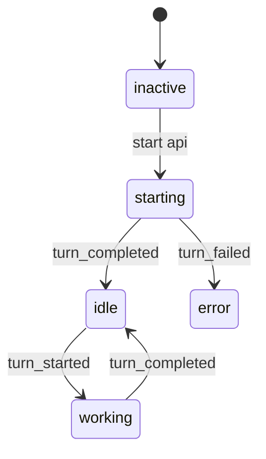
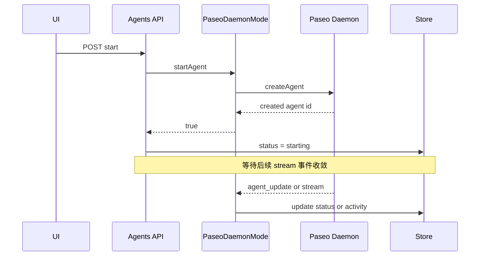
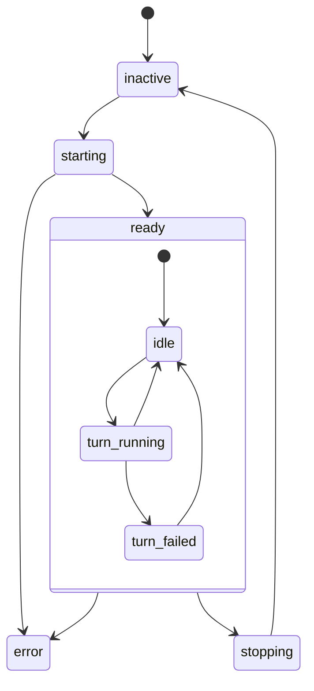
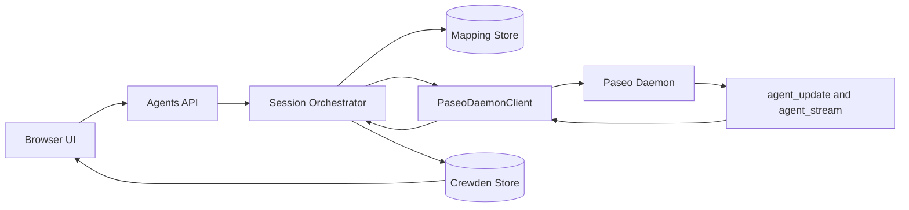
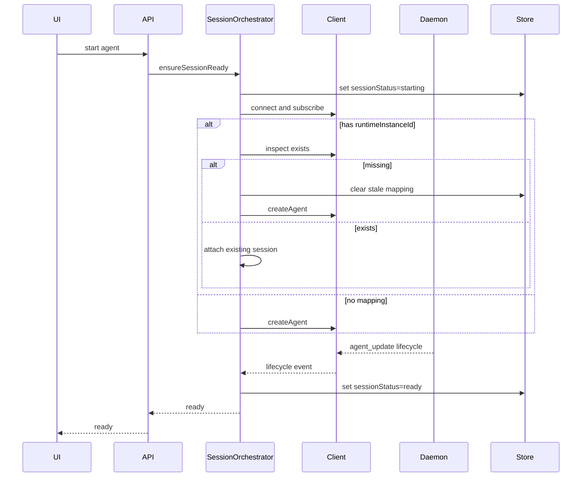
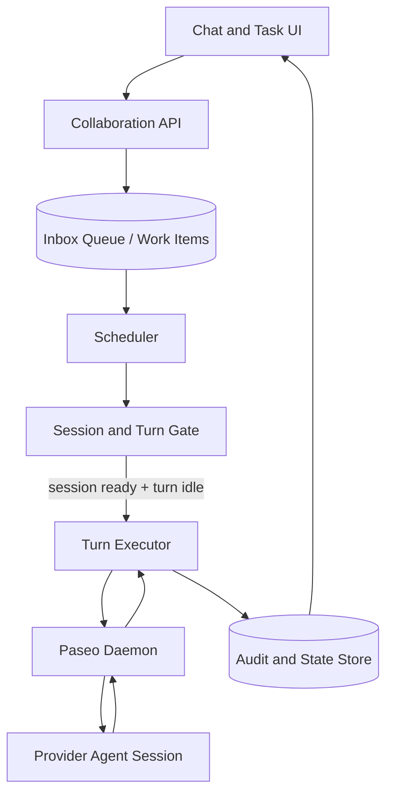

# Crewden × Paseo Turn-based 运行模型根因分析与根治方案

> 日期：2026-05-04  
> 适用范围：Crewden 以 Paseo 作为唯一 Runtime 基座后的 Agent 生命周期与状态同步  
> 参考：`docs/integration/CREWDEN_INTEGRATION.md`

---

## 1. 问题定义

现象：

- 新建或启动 Agent 后，部分 Agent 长时间停留在 `starting`
- UI 显示 `offline/inactive` 与实际 Runtime 会话状态不一致
- Phase0-Phase2 不明显，Phase3 后显性暴露

结论：

这不是单点 bug，也不是“仅靠兜底即可”的问题；本质是 **One-shot 进程语义迁移到 Turn-based 会话语义后，状态机契约未重构完整**。

---

## 2. As-Is 机制分析

### 2.1 数据流（现状）

关键断点：

- `start` 请求成功后，API 立即把 Agent 写成 `starting`
- 后续是否进入 `idle/running` 依赖 stream 事件
- 如果没有及时 turn 事件，`starting` 无法收敛

### 2.2 状态模型（现状）

当前把“会话生命周期”和“单轮 turn 生命周期”混在一个状态通道里，导致语义冲突。

问题：

- `turn_completed` 是“某一轮消息完成”，不是“会话启动完成”
- 无首轮消息时，不会产生 `turn_completed`
- 结果：会话已就绪，但状态仍卡 `starting`

### 2.3 控制流（现状）

问题：

- `start` 成功条件是“创建请求成功”，不是“会话进入 ready”
- 对 `runtimeInstanceId` 的复用没有活性校验，可能复用陈旧映射
- `thread_started(sessionId)` 未持久化，恢复与对账能力不足

---

## 3. 为什么 Phase3 才显性暴露

不是 Phase3 新增一个“坏逻辑”导致，而是 Phase3 让旧问题更可见：

1. 持久化与状态治理更严格，减少了“重启即清零”的偶然掩盖
2. 运行模型切换完成后，系统进入常驻会话模式，状态错位被持续保留
3. UI 与控制平面开始更依赖状态字段，`starting` 卡住不再被忽略

---

## 4. 根因分解（机制层）

### 根因 A：生命周期语义未拆分

- 会话是否可用（session lifecycle）与单轮执行（turn lifecycle）应分离
- 当前同用一个 agent status，导致“会话ready但turn未发生”时状态错误

### 根因 B：Start 契约定义错误

- 当前 `start` = 请求发出成功
- 正确应为 `start` = 会话完成 attach 并进入 ready 可投递

### 根因 C：映射模型缺失活性校验

- `runtimeInstanceId` 有值即复用
- 缺少 `exists/inspect` 校验与失效回收

### 根因 D：事件消费优先级错误

- 应以 `agent_update lifecycle` 为会话主状态源
- `turn` 事件应只影响工作态，不应驱动启动收敛

---

## 5. To-Be 根治设计

## 5.1 三层状态机拆分

1. SessionLifecycle（会话态）

- `inactive -> starting -> ready -> stopping -> inactive`
- 异常支路：`starting/ready/stopping -> error`

2. TurnLifecycle（执行态）

- `idle -> turn_running -> turn_done/turn_failed -> idle`

3. DeliveryLifecycle（投递态）

- `queued -> dispatching -> acked`
- 异常：`dispatching -> retrying -> dead_letter`

## 5.2 新的数据契约

Agent 记录至少要区分：

- `sessionStatus`: inactive | starting | ready | stopping | error
- `turnStatus`: idle | running | failed
- `runtimeInstanceId`: Paseo agent id
- `sessionId`: 来自 thread/session 事件
- `lastLifecycleAt`: 最近 lifecycle 时间戳

UI 展示规则：

- online/offline 只看 `sessionStatus`
- working/thinking 叠加看 `turnStatus + activity`

## 5.3 Start 强契约

`POST /start` 流程必须满足：

1. 创建或绑定 runtime instance
2. 建立 stream 与 lifecycle 订阅
3. 接收到 `agent_update lifecycle in {idle,running}` 或等价 ready 信号
4. 才把 sessionStatus 置为 `ready`

超时则进入 `error`，并记录失败原因。

## 5.4 映射活性校验

当 `runtimeInstanceId` 已存在：

1. 先 `inspect/exists`
2. 存在则 attach
3. 不存在则清映射并重建

禁止“有 id 就直接成功返回”。

## 5.5 事件消费优先级

1. `agent_update lifecycle`：主状态源（sessionStatus）
2. `agent_stream turn_*`：仅更新 turnStatus
3. `timeline`：仅更新消息与 activity
4. `thread_started(sessionId)`：持久化 session 映射

## 5.6 Inbox 与 Turn 的正确耦合

投递前条件：

- `sessionStatus = ready`
- `turnStatus = idle`

每次 sendMessage 绑定 `requestId/turnId`，只有收到对应完成事件才弹出下一条。

---

## 6. To-Be 数据流与控制流

### 6.1 数据流（目标）

### 6.2 控制流（目标）

---

## 7. 详细实施方案

## Phase A：模型与契约重构

1. 新增 `sessionStatus/turnStatus/sessionId` 字段与迁移
2. 把 `/start` 从“fire-and-forget”改为“ready-ack”语义
3. 统一 API 返回：`starting` 只允许短时存在

产出：状态语义完整、前后端一致。

## Phase B：桥接层重构

1. 引入 SessionOrchestrator（替代 scattered start logic）
2. `runtimeInstanceId` 复用前强制活性校验
3. `thread_started` 持久化到 `sessionId`
4. `agent_update` 作为会话主状态输入

产出：启动链路可解释、可恢复。

## Phase C：队列与恢复

1. Inbox 依赖 `ready + idle` 双条件
2. 投递与 turnId/requestId 对齐
3. 启动时 `reconcileSessions`：对账 DB 与 Paseo 实际会话

产出：不会再出现“starting 卡死 + UI 假离线”。

---

## 8. 验收标准

1. 仅 Start 不发消息，状态在 SLA 内从 `starting -> ready`
2. 重启 server 后，agent 状态与 Paseo 实态一致
3. 存在陈旧 runtime id 时可自动修复并重建
4. 任何时刻都能区分“会话在线”与“当前是否在跑 turn”
5. `starting` 不允许长时间滞留，超时必转 `error` 且可观测

---

## 9. 可观测性与运维

必须新增以下指标与日志字段：

- `session_start_latency_ms`
- `session_start_timeout_count`
- `stale_runtime_mapping_recovered_count`
- `agent_status_stuck_starting_count`
- 结构化字段：`agentId runtimeInstanceId sessionId launchId`

---

## 10. 结论

根本解决路径不是“多加一个兜底 if”，而是完成以下三件事：

1. **语义解耦**：会话态与 turn 态分离
2. **契约重写**：start 以 ready 为完成条件
3. **映射治理**：runtime 映射先校验后复用

这三项完成后，Turn-based 模型才能稳定替代 One-shot，并满足 `docs/integration/CREWDEN_INTEGRATION.md` 的目标：

- Paseo 管生命周期
- Crewden 管协作
- 状态可解释、可恢复、可回归

---

## 11. 与“Inbox 队列 vs Turn-based”讨论的一致性

结论：**无冲突，且完全一致。**

本方案不是“放弃 Turn-based”，也不是“回退 One-shot”，而是把两者放在不同层次：

1. 外层调度层：Inbox-first（可靠性、优先级、恢复、审计）
2. 内层执行层：Turn executor（每次消费仍走 provider 原生 turn）

这与既有讨论结论一致：

- 纯 Turn-based：聊天自然，但多任务治理弱
- 纯 Inbox：治理强，但实时聊天可能退化
- 最优路径：**Inbox-first + Turn executor 混合模型**

根因文档中的 `SessionLifecycle / TurnLifecycle / DeliveryLifecycle` 三层拆分，正是该混合模型在系统层面的实现形态。

---

## 12. 混合模型落地图（Inbox-first + Turn executor）

设计要点：

1. Inbox 负责“是否执行、何时执行、先执行谁”
2. Turn executor 负责“每次执行一轮 LLM 推理”
3. Session Gate 负责“会话可用性 + 单轮互斥”约束
4. Store 负责“幂等、审计、死信、恢复基线”

---

## 13. 后续扩展路线（基于当前根治方案）

### 13.1 调度能力扩展（Inbox 层）

1. 优先级队列：`urgent/high/normal/low`
2. 延时与重试队列：按 `nextRetryAt` 调度
3. 依赖阻塞模型：`blockedByTaskIds` 原生进入调度判定
4. 死信队列：失败上限后转 `dead_letter`，人工或自动补偿

### 13.2 聊天实时性保护（Turn 层）

1. 聊天消息与任务消息分通道队列（chat-lane/task-lane）
2. 配额策略：每 N 个 task turn 至少穿插 1 个 chat turn
3. 轻量抢占：高优先级聊天可中断低优先级任务排队（不抢占正在执行的 turn）

### 13.3 恢复与一致性（恢复层）

1. Server 重启恢复：重建 session map、重放未完成 work items
2. Daemon 断连恢复：自动重连后做 `reconcileSessions`
3. 幂等保障：`idempotency_key` 覆盖 message/task/delegate/review 全链路

### 13.4 观测与SLA（治理层）

1. 指标：排队时延、turn 时延、死信率、恢复成功率
2. 追踪：work item id 贯穿 `queue -> turn -> result`
3. 告警：`starting` 超时、session 失配、重试风暴

---

## 14. 决策摘要（供评审快速确认）

1. 本文方案与“Inbox vs Turn-based”讨论**无冲突**。
2. 系统终态不是“二选一”，而是**分层混合**：
   - 调度可靠性用 Inbox
   - 推理执行仍用 Turn-based
3. 当前 `starting` 卡住问题属于“层次混用导致的状态机错误”，根治方式是三层状态机与控制契约重构，而非单点兜底。

---

## 15. 可执行任务清单（实施版）

### 15.1 启动契约与映射活性（P0）

- [x] `PaseoDaemonClient` 增加 `fetch_agent_request` 封装（按 runtimeInstanceId 探活）
- [x] `PaseoDaemonMode.startAgent()` 在复用 `runtimeInstanceId` 前强制探活
- [x] 探活失败时清理陈旧映射（`runtime_instance_id` / 内存 queue / channel map）
- [ ] `startAgent` 返回语义升级为 `ready | accepted | failed`（当前先保留布尔返回，后续兼容升级）

### 15.2 状态轴解耦（P0）

- [x] `agent_update.lifecycle` 作为 Agent 主状态来源（session 生命周期轴）
- [x] `turn_*` 仅映射为 activity，不再直接改 Agent 主状态
- [x] `thread_started(sessionId)` 映射为 session 事件并记录
- [ ] 增加 `session_id` 持久化字段（当前先以内存 + activity 记录）

### 15.3 启动写库策略（P1）

- [x] 去除 route/task/delegation 里的“盲写 `status=starting`”
- [x] 统一改为：只写 `machineId/autoStart`，状态由 runtime lifecycle 回填
- [ ] 启动超时治理：`start_timeout_ms` + 超时后显式错误状态

### 15.4 回归测试（P1）

- [x] 更新 `TimelineToEventBridge` 单测（`turn_*`/`thread_started` 新语义）
- [ ] 增加 stale `runtimeInstanceId` 复用失败回归测试
- [ ] 增加 “刷新后不响应 / 假在线” 场景回归用例

### 15.5 运维与观测（P2）

- [ ] 落地指标：`stale_runtime_mapping_recovered_count`
- [ ] 落地指标：`agent_status_stuck_starting_count`
- [ ] 结构化日志补齐：`agentId runtimeInstanceId sessionId launchId`
